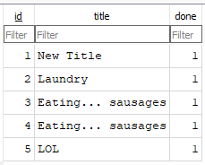

# Task API

A simple to-do list API built with Node.js and Express. Full CRUD operations with interactive Swagger UI documentation.

## Database

**Why SQLite?** Zero configuration. No separate server process, no setup needed. The database is a single file that persists on disk, so data survives server restarts. Perfect for a lightweight API like this.

**Location:** `tasks.db` in the project root. It is created automatically when the server starts (`database.js` handles table creation and seeding).

## Install & Run

```bash
git clone https://github.com/AnelkaCH/BE-01.git
cd BE-01
npm install
npm start
```

Server runs at `http://localhost:3000`.

## Endpoints

| Method  | Path            | Description              | Status Codes  |
|---------|-----------------|--------------------------|---------------|
| GET     | /               | API description          | 200           |
| GET     | /health         | Health check             | 200           |
| GET     | /tasks          | List all tasks           | 200           |
| GET     | /tasks/:id      | Get a single task        | 200, 404      |
| POST    | /tasks          | Create a new task        | 201, 400      |
| PUT     | /tasks/:id      | Update a task            | 200, 400, 404 |
| DELETE  | /tasks/:id      | Delete a task            | 204, 404      |
| GET     | /docs           | Swagger UI documentation | 200           |

## Example Output

```
$ curl -i http://localhost:3000/tasks

HTTP/1.1 200 OK
Content-Type: application/json

[{"id":1,"title":"Buy groceries","done":0},{"id":2,"title":"Read a chapter","done":1}]
```

## Swagger UI

Interactive API documentation is available at `http://localhost:3000/docs`. You can test the full CRUD cycle directly from the browser using the **Try it out** button on each endpoint.


## Manual SQL Queries

Open `tasks.db` with any SQLite viewer (e.g. [DB Browser for SQLite](https://sqlitebrowser.org/)) and run:

| Query | Description |
|-------|-------------|
| `SELECT * FROM tasks;` | List every task |
| `SELECT * FROM tasks WHERE done = 1;` | Show only completed tasks |
| `SELECT COUNT(*) FROM tasks;` | Count all tasks |
| `UPDATE tasks SET done = 1;` | Mark every task as completed |
| `DELETE FROM tasks WHERE done = 1;` | Delete all completed tasks |

Changes made directly to the database are immediately reflected in the API.


