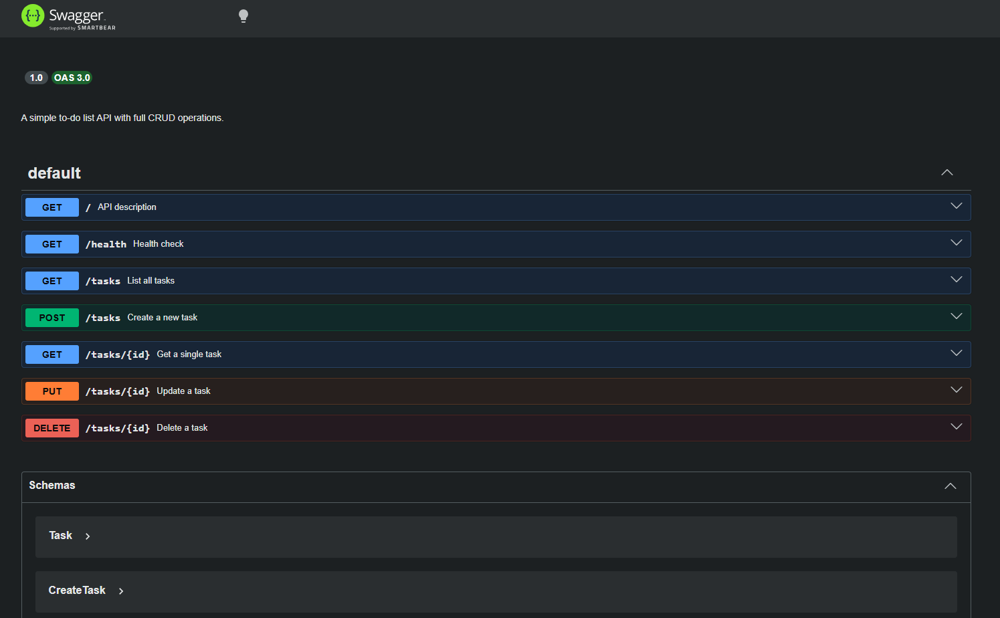

# Task API

A simple to-do list API built with Node.js and Express. Full CRUD operations with interactive Swagger UI documentation.

## Submission Notes
- Assignment 1 (in-memory version): see tag `BE-01`
- Assignment 2 (SQLite version): see branch `BE-02`

## Install & Run

```bash
git clone https://github.com/AnelkaCH/BE-01.git
cd BE-01
npm install
npm start
```

Server runs at `http://localhost:3000`.

## Endpoints

| Method  | Path            | Description              | Status Codes  |
|---------|-----------------|--------------------------|---------------|
| GET     | /               | API description          | 200           |
| GET     | /health         | Health check             | 200           |
| GET     | /tasks          | List all tasks           | 200           |
| GET     | /tasks/:id      | Get a single task        | 200, 404      |
| POST    | /tasks          | Create a new task        | 201, 400      |
| PUT     | /tasks/:id      | Update a task            | 200, 400, 404 |
| DELETE  | /tasks/:id      | Delete a task            | 204, 404      |
| GET     | /docs           | Swagger UI documentation | 200           |

## Example Output

```
$ curl -i http://localhost:3000/tasks

HTTP/1.1 200 OK
Content-Type: application/json

[{"id":1,"title":"Buy groceries","done":false},{"id":2,"title":"Read a chapter","done":true},{"id":3,"title":"Push code to GitHub","done":false}]
```

## Swagger UI

Interactive API documentation is available at `http://localhost:3000/docs`. You can test the full CRUD cycle directly from the browser using the **Try it out** button on each endpoint.


